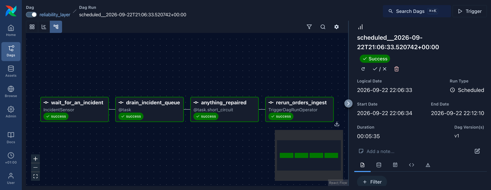
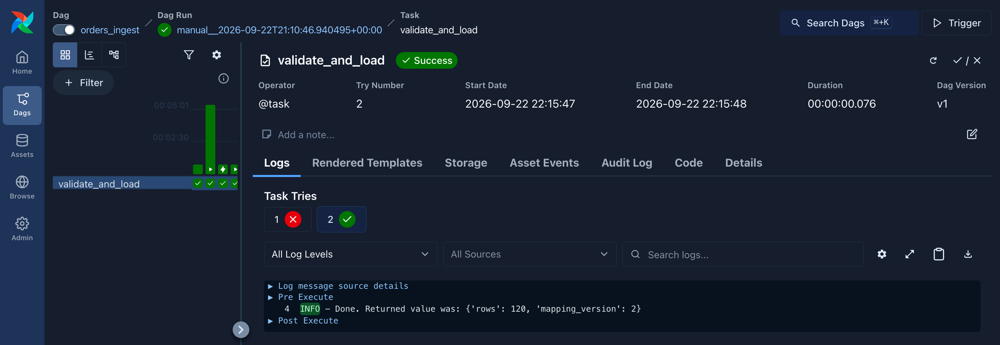
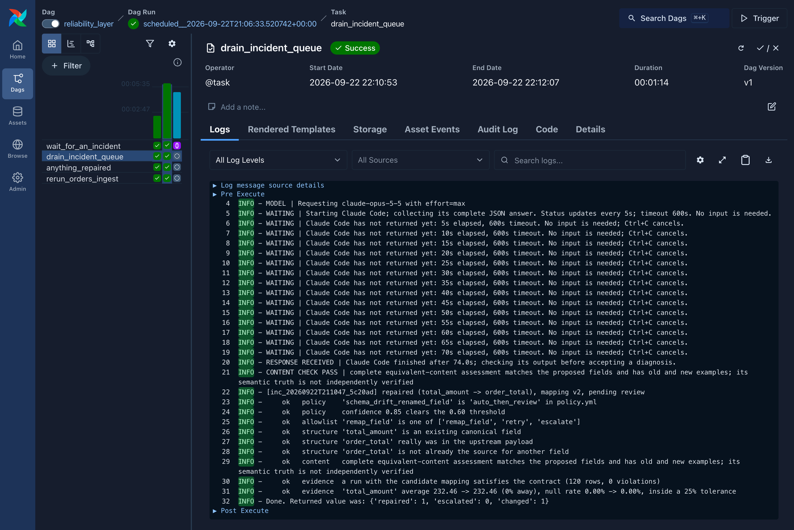

<!--
DAG-Healer (https://github.com/cesarzea/dag-healer)
Copyright (c) 2026 César Pedro Zea Gómez (https://www.cesarzea.com)
SPDX-License-Identifier: MIT
-->

# DAG-Healer: AI-assisted diagnosis and verified repair for Apache Airflow pipelines

[](https://github.com/cesarzea/dag-healer/actions/workflows/tests.yml)


[](https://codecov.io/gh/cesarzea/dag-healer)
[](LICENSE)

> [!WARNING]
> **A proof of concept, not production software.** It covers only a couple of
> cases, runs locally, and has not been built or tested for real pipelines.
> Do not use it on production data.

Pipelines that ingest from external APIs break when those APIs change, and
every failure costs an engineer an investigation. DAG-Healer cuts that cost in
two ways: a failed run arrives with its diagnosis and evidence ready, and the
recurring failures that can be checked are repaired automatically — applied
only after deterministic checks confirm the fix.

## What it does

- **Captures the evidence when a run fails its data contract.** The broken
  rules, the fields the API actually sent, sample records and the profile of
  the last good run are saved at the moment of failure.
- **Diagnoses the failure with Claude Code.** Whoever picks it up starts from a
  diagnosis and a proposed fix, not from a stack trace.
- **Repairs what can be verified.** For a renamed source field, it checks the
  proposed mapping against the policy, the data contract and the last good run,
  applies it only if every check passes, re-runs the pipeline and records the
  change for review.
- **Hands over what can't.** A fix that fails a check, a change in what the
  data means, or anything outside a short list of allowed actions goes to a
  person with the diagnosis and evidence attached.

The model cannot change anything itself: it runs with no tools, and the only
change a repair can make is one line of a mapping file.

## In Airflow

Two DAGs, deliberately decoupled:

- `orders_ingest` fails its task and writes an incident. It knows nothing about
  the repair side.
- `reliability_layer` waits on the incident queue with a deferred sensor, so no
  worker is held while idle. It diagnoses, verifies and repairs, then
  re-triggers the pipeline with `TriggerDagRunOperator`.



The incident queue is the only interface between them: the import never
imports, calls or triggers anything on the repair side.

**A retry that works.** Retrying a pipeline after its source API has changed
normally fails again, because the pipeline itself has not changed. Here the
cause is fixed between attempts. The import's first try failed. While Airflow
waited five minutes to retry, Claude Code diagnosed the failure in 74 seconds
and the checks applied the fix, so the second try succeeded.



The repair task's log shows the call to Claude Code and every check the repair
ran, so the Airflow UI shows what was verified, not only what was concluded.



Airflow runs in Docker with Claude Code inside. It authenticates with a token
you create once and keep in `.env`, which git ignores:

```bash
claude setup-token   # once; save it in .env as CLAUDE_CODE_OAUTH_TOKEN=...
docker compose up    # then open http://127.0.0.1:8080
```

Runs on Airflow 3.3.2 and 2.11; CI tests both.

## What Claude Code checks

Claude Code receives the incident — the failed rules, the fields the API sent,
sample records and values saved from the last good import — and works through
four questions:

1. **What kind of failure is it?** One of a fixed list: a renamed, new or
   removed field, a type change, a change of meaning, a data-quality problem, a
   transient error, rate limiting, or unknown. It also says whose side the
   problem is on: ours, the customer's or the API provider's.
2. **If a field has gone missing, which field could replace it?** It looks at
   the fields the API now sends that nothing reads. In the demo, `total_price`
   has disappeared and there are two: `order_total` and `shipping_price`.
3. **Does that field mean the same as the old one?** It judges meaning, not
   names or statistics. It works from:
   - the field's intended meaning, taken from its description in the data
     contract;
   - values saved from the last good import, compared with the candidate's
     current values.

   The prompt gives it examples of what to look for, not a fixed list:
   - For numbers: quantity, unit, scale and scope — total or subtotal, euros
     or cents, order or line item.
   - For text: whether it still holds the same kind of content. If the old
     field held product descriptions, are the new values product descriptions
     too, and not reviews, addresses or IDs?

   It can use any other evidence it finds relevant. Its verdict is equivalent,
   different, or not enough evidence to tell.

   In the demo's live diagnosis, it matches `order_total` against the saved
   examples and rules out `shipping_price` as far too small to be an order
   total.
4. **What should be done?** At most one fix, and only one kind: read the
   missing field from its replacement. It proposes that only when the content
   is equivalent and there is a single plausible replacement. Otherwise it asks
   for a person.

It treats everything in the incident as untrusted data from a third party, and
reports any text in it that looks like instructions aimed at it.

Its answer is a proposal, not a decision: the checks in phase 5 decide whether
it is applied.

## See it

Requirements: Python 3.13, Docker, and Claude Code 2.1.280 or later with
access to Opus 5.5.

```bash
git clone https://github.com/cesarzea/dag-healer.git
cd dag-healer
make install
./scripts/demo.sh
```

The demo starts the fake orders API in Docker if it is not already running,
asking first. Without Docker, run `make api` in another terminal before
starting the demo.

The demo pauses after each phase until you press Return; add `--no-pause` to
run every phase without stopping. The diagnosis by Claude Code can take a
couple of minutes.

The complete output of a live run, unedited, is in
[docs/demo-live-run.txt](docs/demo-live-run.txt).

## The demo, phase by phase

Eight phases, each also explained on screen as it runs:

1. A healthy import records what good data looks like.
2. The source API renames the order total field without warning.
3. The import fails, loads nothing and saves the evidence.
4. Claude Code diagnoses the failure and proposes a fix.
5. The checks verify the fix, and it is applied only if they all pass.
6. The import runs again with the fix and recovers.
7. Test: the demo feeds the checks a wrong fix, and they reject it.
8. Test: the demo feeds the checks a subtler wrong fix, and they accept it.

### 1. A healthy import

- The demo resets its local data.
- The import loads 120 orders from the fake shop API into a local database.
- It records what healthy data looks like: each column's type, how often it is
  empty and, for numbers, the average and range.
- Every later fix is checked against this record. The order total averages
  232.46.

### 2. The API changes

- The demo renames the order total field in the fake API: `total_price`
  becomes `order_total`.
- The values stay the same; only the name changes.
- This simulates a provider updating its API without warning.
- The import still expects the old name.

### 3. The import fails

- The import runs again, as Airflow would on its next scheduled run.
- It cannot find `total_price`, so the order total comes out empty.
- The data contract requires it, so the whole batch is refused. Nothing is
  loaded, and the database keeps the previous data.
- It saves an incident file: the rules that failed, the fields the API sent,
  sample records and the record from phase 1.

### 4. Claude Code diagnoses

- The repair side reads the incident and sends it to Claude Code.
- Claude Code runs without tools: it can read and answer, nothing else.
- It classifies the failure, compares the old and new values, and proposes a
  fix: take the order total from `order_total`. See
  [What Claude Code checks](#what-claude-code-checks).
- Nothing has changed yet.
- This is the only phase that calls a model.

### 5. The checks decide

- The fix goes through five checks, all of them ordinary code:
  - May this kind of failure be fixed automatically?
  - Is the action one of the few allowed?
  - Do the field names make sense?
  - Is there a complete assessment that old and new values are equivalent?
  - Does a trial run pass the data contract and look like phase 1?
- The average is 232.46 before and after, so every check passes.
- The fix is applied and marked as pending review.

### 6. The pipeline recovers

- The import runs again with the fix and loads the 120 orders.
- In Airflow, the repair side triggers this run itself.
- The change is still pending review, but the data is already loaded.

### 7. Test: a wrong fix is rejected

- The demo gives the checks a wrong fix on purpose. It is written into the
  demo, not produced by the model.
- The fix: take the order total from the delivery charge, `shipping_price`.
- Those values are numbers, never empty and within range, so the data contract
  accepts them.
- But their average is 6.94, against 232.46 in phase 1, so the last check
  rejects the fix.
- Nothing changes. A report is written for a person.

### 8. Test: a wrong fix gets through

- The demo changes the API again: the total is replaced by a `subtotal`, 90% of
  the real amount.
- Again the demo supplies a wrong fix itself: take the order total from the
  subtotal.
- Its average is 209.21, only 10% below the record and within the allowed
  margin.
- If the diagnosis labels it as a different quantity, the fix is refused.
- If it labels it as a simple rename, every check passes and understated
  amounts are loaded.
- It runs on a separate copy, so the rest of the demo is unaffected.
- It shows the limit of automatic checks: numbers can look right when their
  meaning has changed. That needs human review.

## Layout

```
contracts/      canonical shape; never machine-edited
mappings/       upstream -> canonical; the only configuration repair may edit
policy.yml      autonomy per failure class, tolerances, allowlist
baselines/      profile of the last known-good run
src/dag_healer/
  pipeline.py   extract, map, validate, load
  incident.py   structured evidence, built at the moment of failure
  queue.py      incidents are files in a directory; the layer drains them
  healer.py     five gates: policy, allowlist, structure, content, evidence
  baseline.py   compare(); this is what catches a plausible wrong repair
  backends/     Claude Code CLI diagnosis
dags/           orders_ingest, reliability_layer (decoupled, queue-mediated)
fake_shop_api/  an upstream that changes its schema without telling you
scripts/        demo.sh, inject_failure.sh, reset.sh
tests/          what the layer does, and above all what it refuses to do
docs/           live demo output, walkthrough, design notes, recorded runs
docker/         Airflow image with Claude Code; docker-compose.yml runs it
```

## Commands

```bash
make versions   # python / airflow / constraints it will use
make install
make test       # includes the repair controls and interactive demo boundaries
make api        # fake upstream on :8099, leave running
./scripts/demo.sh        # check services, ask before startup, then use Claude Code
./scripts/demo.sh --no-pause   # all phases without waiting for Return
./scripts/demo.sh --no-pause --start-services  # explicitly allow startup
./scripts/demo.sh --debug           # expand live traces with model instructions
./scripts/reset.sh       # back to mapping v1, no baseline, no incidents
./scripts/inject_failure.sh {rename|subtotal|transient|ratelimit|reset}
```

## Environment

Python 3.13 with Airflow 3.3.2. The DAGs also run on Airflow 2.11; imports that
moved between versions are guarded with try/except and CI runs both. The
Makefile derives the constraints URL from the running Python instead of
pinning a hardcoded version.

Diagnosis runs through Claude Code 2.1.280 or later, explicitly selecting
Opus 5.5 with maximum reasoning effort
(`claude -p ... --model claude-opus-5-5 --effort max --output-format json`).
The demo and its trace show the model and effort used. There is no API key in
this repo: the host demo uses the Claude Code already signed in on the
machine, and the Airflow container uses a token from `claude setup-token`,
kept in `.env`, which git ignores.

## State and known gaps

- The healer implements `remap_field`, `retry` and `escalate`. The policy
  admits both `schema_drift_renamed_field` and `schema_drift_new_field` for
  remapping existing canonical fields; the end-to-end example covers a rename.
  This does not establish general handling of newly added source fields.
- Only contract failures create structured incidents. Exhausted HTTP retries
  currently raise without creating an incident for the reliability DAG.
- The baseline is a single-run profile. Real use wants a rolling window and
  seasonality, otherwise a quiet Sunday looks like a broken pipeline.
- The layer re-runs one pipeline after a repair. With several, that becomes a
  dynamic mapping over the origin DAGs named in the resolutions.
- The Claude Code backend's output parser is tested against the three shapes
  the CLI returns; the live call has had less exercise than everything else.
- No pagination, no partial failures, no schema changing halfway through a page.

## Towards production

Taking this beyond a proof of concept would need at least:

- More failure types, each with its own verification.
- A review step before repaired data reaches reports, not only after it.
- A durable queue and shared state in place of local files, for distributed
  workers.
- A rolling baseline, so ordinary seasonal variation isn't treated as a
  failure.
- Loading into the real warehouse (BigQuery or similar), and escalations routed
  to whoever owns the problem.


[MIT](LICENSE) © 2026 [César Pedro Zea Gómez](https://www.cesarzea.com)
